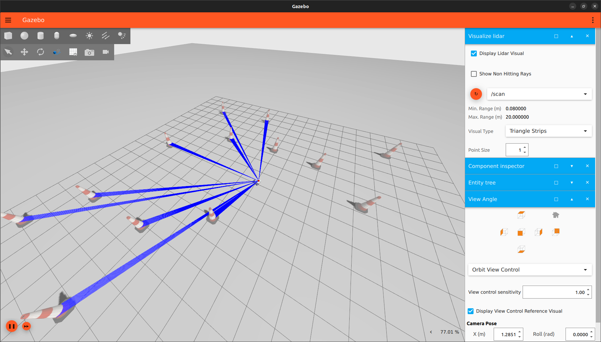
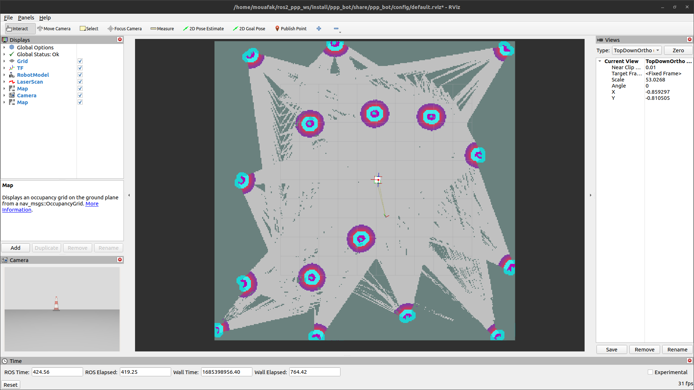
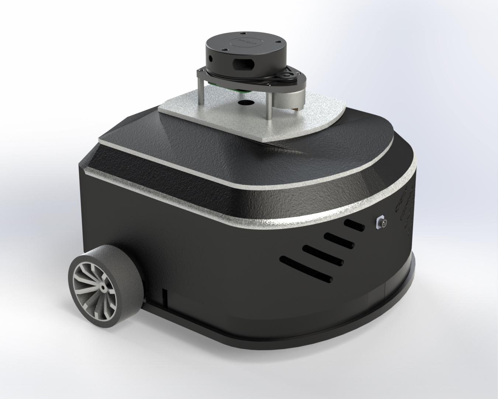
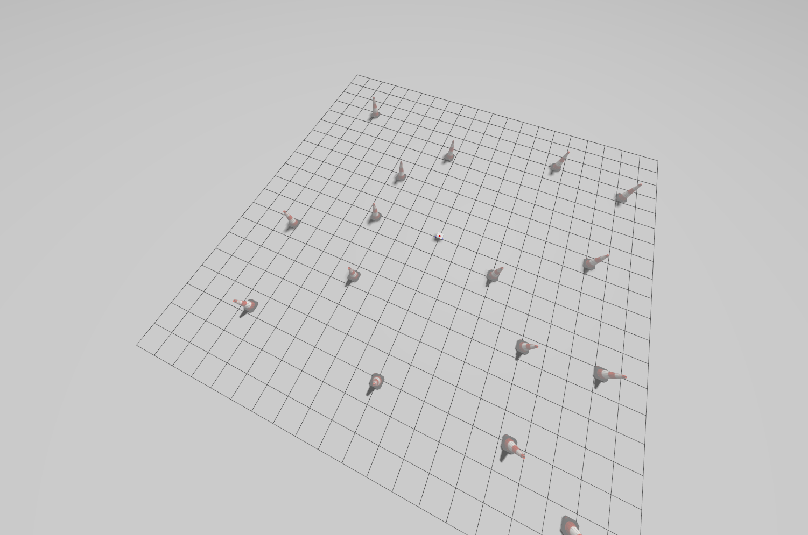
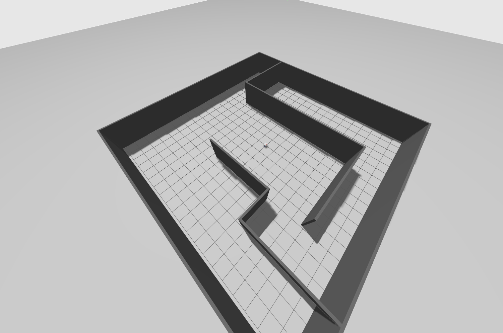
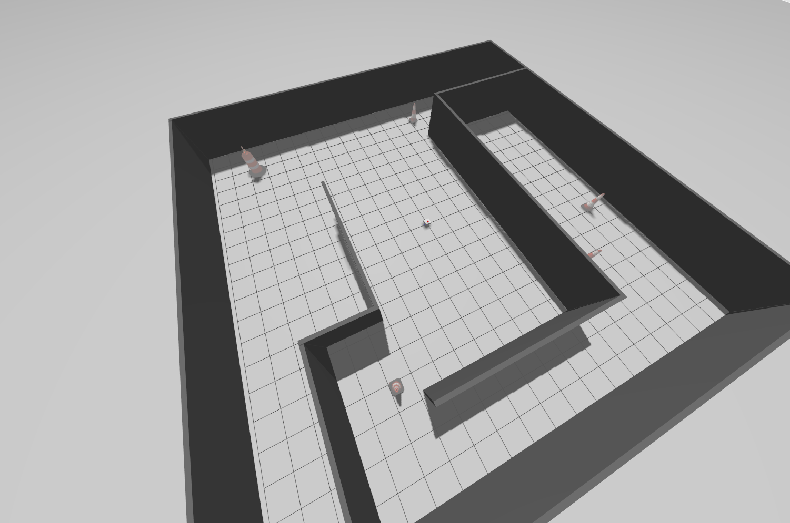
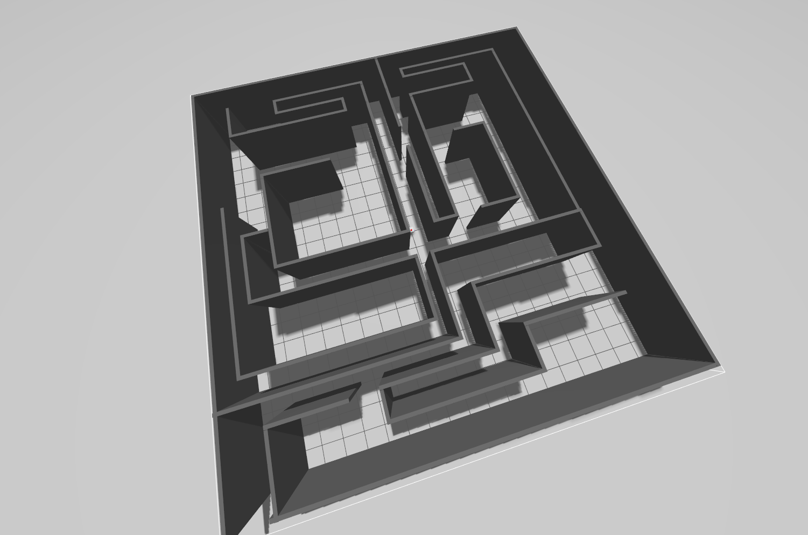

# DDR-SLAM: Comprehensive ROS2 Differential Drive Robot SLAM System

## Table of Contents
1. [Project Overview](#project-overview)
2. [System Architecture](#system-architecture)
3. [Installation Guide](#installation-guide)
4. [Workspace Structure](#workspace-structure)
5. [Robot Description](#robot-description)
6. [Simulation Worlds](#simulation-worlds)
7. [Launch Files](#launch-files)
8. [Configuration Files](#configuration-files)
9. [Usage Instructions](#usage-instructions)
10. [Video Demonstrations](#video-demonstrations)
11. [Troubleshooting](#troubleshooting)
12. [Development Guide](#development-guide)
13. [Acknowledgements](#acknowledgements)

## Project Overview

DDR-SLAM is a comprehensive ROS2-based project that implements Simultaneous Localization and Mapping (SLAM) for a differential drive robot. The project uses Gazebo Fortress as a simulation environment to test and validate the SLAM algorithm in various scenarios.

### Key Features
- **Differential Drive Robot**: Custom-designed robot with LiDAR and camera sensors
- **SLAM Implementation**: Uses slam_toolbox for online asynchronous SLAM
- **Navigation Stack**: Full Nav2 integration for autonomous navigation
- **Multiple Worlds**: Four different simulation environments for testing
- **Teleoperation**: Keyboard and joystick control options
- **WSL2 Compatibility**: Optimized for Windows Subsystem for Linux 2

### Technologies Used
- **ROS2 Humble**: Robot Operating System 2
- **Gazebo Fortress**: Physics simulation engine
- **slam_toolbox**: SLAM algorithm implementation
- **Nav2**: Navigation framework
- **XACRO**: XML macro language for robot description
- **ros2_control**: Robot control framework

## System Architecture

The system consists of several interconnected components:

```
┌─────────────────┐    ┌─────────────────┐    ┌─────────────────┐
│   Gazebo        │    │   ROS2          │    │   RViz2         │
│   Simulation    │◄──►│   Nodes         │◄──►│   Visualization │
└─────────────────┘    └─────────────────┘    └─────────────────┘
         │                       │                       │
         ▼                       ▼                       ▼
┌─────────────────┐    ┌─────────────────┐    ┌─────────────────┐
│   Robot Model   │    │   SLAM          │    │   Navigation    │
│   (XACRO/URDF)  │    │   (slam_toolbox)│    │   (Nav2)        │
└─────────────────┘    └─────────────────┘    └─────────────────┘
```

### Core Components
1. **Robot Description**: XACRO-based URDF with sensors and actuators
2. **Simulation Environment**: Gazebo Fortress with custom worlds
3. **SLAM System**: slam_toolbox for mapping and localization
4. **Navigation Stack**: Nav2 for path planning and control
5. **Teleoperation**: Multiple input methods for robot control
6. **Visualization**: RViz2 for real-time data visualization

| Gazebo Ignition | RViz2 Visualization |
|:---:|:---:|
|  |  |

The system uses Gazebo Ignition for physics simulation and RViz2 for visualization of sensor data, maps, and navigation information.

## Installation Guide

### Prerequisites
- Ubuntu 22.04 (or WSL2 with Ubuntu 22.04) - **Already Installed**
- ROS2 Humble - **Already Installed**
- Git

### Step-by-Step Installation

1. **Install Gazebo Fortress**

   **Step 1: Install Necessary Tools**
   ```bash
   sudo apt-get update
   sudo apt-get install lsb-release gnupg
   ```

   **Step 2: Add Ignition Gazebo Repository**
   ```bash
   sudo curl https://packages.osrfoundation.org/gazebo.gpg --output /usr/share/keyrings/pkgs-osrf-archive-keyring.gpg
   echo "deb [arch=$(dpkg --print-architecture) signed-by=/usr/share/keyrings/pkgs-osrf-archive-keyring.gpg] http://packages.osrfoundation.org/gazebo/ubuntu-stable $(lsb_release -cs) main" | sudo tee /etc/apt/sources.list.d/gazebo-stable.list > /dev/null
   sudo apt-get update
   ```

   **Step 3: Install Ignition Fortress**
   ```bash
   sudo apt-get install ignition-fortress
   ```

   **Step 4: Verify the Installation**
   ```bash
   ign gazebo
   ```

2. **Install Required ROS2 Packages**

   Install all the dependencies listed in the package.xml:

   ```bash
   # Core ROS2 packages
   sudo apt install ros-humble-ros-gz-sim ros-humble-ros-gz-bridge
   
   # SLAM and Navigation packages
   sudo apt install ros-humble-slam-toolbox ros-humble-navigation2
   
   # Visualization and tools
   sudo apt install ros-humble-rviz2 xterm
   
   # Robot control and utilities
   sudo apt install ros-humble-twist-mux ros-humble-xacro
   
   # Build tools and testing
   sudo apt install ros-humble-ament-cmake ros-humble-ament-lint-auto ros-humble-ament-lint-common
   
   # Launch tools
   sudo apt install ros-humble-ros2launch
   
   # Additional packages for teleoperation (if needed)
   sudo apt install ros-humble-teleop-twist-keyboard ros-humble-teleop-twist-joy ros-humble-joy
   
   # Update package list
   sudo apt update
   ```

3. **Create ROS2 Workspace**
   ```bash
   mkdir -p ~/ros2_workspace/src
   cd ~/ros2_workspace/src
   ```


3. **Install Dependencies**
   ```bash
   # Initialize rosdep (first time only)
sudo rosdep init
rosdep update

   # Install package dependencies
export IGNITION_VERSION=fortress
cd ~/ros2_workspace/src
rosdep install -r --from-paths . --ignore-src --rosdistro $ROS_DISTRO -y
cd ~/ros2_workspace
rosdep install --from-paths src -y --ignore-src
   ```

4. **Build the Workspace**
   ```bash
colcon build
```

5. **Handle Controller Manager Error (if needed)**
   ```bash
   # If you encounter controller_manager related errors
sudo apt install ros-humble-ros2-control ros-humble-ros2-controllers
colcon build
```

6. **Source the Workspace**
   ```bash
   source ~/ros2_workspace/install/local_setup.bash
   ```

## Workspace Structure

```
gazebo_fortress_robot/
├── images/                          # Screenshots and documentation images
│   ├── cones_world.png
│   ├── ignition.png
│   ├── maze_world.png
│   ├── robot_design1.jpg
│   ├── robot_design2.jpg
│   ├── room_with_cones_world.png
│   ├── room_world.png
│   └── rviz2.png
├── install/                         # Built packages (generated)
├── log/                            # Build logs (generated)
├── README.md                       # This comprehensive documentation
├── WSL_GPU_FIXES.md               # WSL2 graphics troubleshooting guide
└── src/
    └── ppp_bot/                    # Main robot package
        ├── CMakeLists.txt          # Build configuration
        ├── package.xml             # Package metadata and dependencies
        ├── config/                 # Configuration files
        │   ├── default.rviz        # RViz2 configuration
        │   ├── joystick.yaml       # Joystick parameters
        │   ├── mapper_params_online_async.yaml  # SLAM parameters
        │   ├── my_controllers.yaml # Robot controller parameters
        │   ├── nav2_params.yaml    # Navigation parameters
        │   └── twist_mux.yaml      # Twist multiplexer configuration
        ├── description/            # Robot description files
        │   ├── robot.urdf.xacro    # Main robot URDF
        │   ├── robot_core.xacro    # Robot chassis and wheels
        │   ├── lidar.xacro         # LiDAR sensor description
        │   ├── camera.xacro        # Camera sensor description
        │   ├── depth_camera.xacro  # Depth camera (commented out)
        │   ├── inertial_macros.xacro # Inertial properties
        │   ├── materials.xacro     # Visual materials
        │   ├── ignition_control.xacro # Ignition control (commented out)
        │   └── ros2_control.xacro  # ROS2 control configuration
        ├── launch/                 # Launch files
        │   ├── launch_sim.launch.py        # Main simulation launch
        │   ├── launch_ign.launch.py        # Gazebo Ignition launch
        │   ├── navigation.launch.py        # Navigation stack launch
        │   ├── online_async.launch.py      # SLAM launch
        │   ├── localization.launch.py      # Localization launch
        │   ├── keyboard.launch.py          # Keyboard teleop
        │   ├── joystick.launch.py          # Joystick teleop
        │   ├── rsp.launch.py               # Robot state publisher
        │   ├── teleop_sim.launch.py        # Teleop simulation
        │   └── legacy_launch_sim.launch.py # Legacy launch (backup)
        ├── maps/                   # Pre-built maps
        │   ├── cones.data          # SLAM data for cones world
        │   ├── cones.pgm           # Occupancy grid map
        │   ├── cones.posegraph     # Pose graph data
        │   ├── cones.yaml          # Map metadata
        │   ├── maze.data           # SLAM data for maze world
        │   ├── maze.pgm            # Occupancy grid map
        │   ├── maze.posegraph      # Pose graph data
        │   ├── maze.yaml           # Map metadata
        │   ├── room_with_cones.data # SLAM data for room with cones
        │   ├── room_with_cones.pgm  # Occupancy grid map
        │   ├── room_with_cones.posegraph # Pose graph data
        │   ├── room_with_cones.yaml # Map metadata
        │   ├── room.data           # SLAM data for room world
        │   ├── room.pgm            # Occupancy grid map
        │   ├── room.posegraph      # Pose graph data
        │   └── room.yaml           # Map metadata
        ├── models/                 # 3D models for simulation
        │   ├── construction_barrel/ # Construction barrel model
        │   ├── construction_cone/   # Construction cone model
        │   ├── maze/               # Maze structure model
        │   └── room/               # Room structure model
        └── worlds/                 # Simulation world files
            ├── barrels.sdf         # World with construction barrels
            ├── cones.sdf           # World with construction cones
            ├── empty.sdf           # Empty world for testing
            ├── maze.sdf            # Maze world
            ├── moving_robot.sdf    # World with moving robot
            ├── room_with_cones.sdf # Room with cones obstacles
            └── room.sdf            # Simple room world
```

## Robot Description

### Robot Design
The robot is a differential drive platform with the following specifications:

| Front View | Interior View |
|:---:|:---:|
|  |  |

- **Chassis**: 30cm × 30cm × 15cm rectangular body
- **Wheels**: Two 10cm diameter wheels with 35cm separation
- **Caster Wheel**: Spherical caster for stability
- **Sensors**: 
  - LiDAR: 360° laser scanner (640 samples, 10Hz update rate)
  - Camera: RGB camera (640×480 resolution, 10Hz update rate)
- **Control**: ROS2 control with differential drive controller

### XACRO Structure
The robot description is modularly organized using XACRO macros:

1. **robot.urdf.xacro**: Main robot file that includes all components
2. **robot_core.xacro**: Defines chassis, wheels, and basic structure
3. **lidar.xacro**: LiDAR sensor with Gazebo plugin configuration
4. **camera.xacro**: Camera sensor with optical frame transformation
5. **ros2_control.xacro**: ROS2 control interfaces for wheel joints
6. **inertial_macros.xacro**: Inertial properties for all links
7. **materials.xacro**: Visual materials for different components

### Key Parameters
- **Wheel Separation**: 0.35 meters
- **Wheel Radius**: 0.05 meters
- **LiDAR Range**: 0.08 to 20.0 meters
- **Camera FOV**: 1.089 radians (62.4 degrees)
- **Robot Mass**: 0.5 kg (chassis) + 0.2 kg (wheels) + 0.1 kg (caster)

## Simulation Worlds

The project includes four different simulation environments:

### 1. Cones World (`cones.sdf`)
- **Description**: Open space with 15 construction cones as obstacles
- **Purpose**: Testing SLAM in cluttered environments
- **Features**: Randomly placed cones for dynamic obstacle avoidance
- **Map**: Pre-built occupancy grid available

### 2. Room World (`room.sdf`)
- **Description**: Simple rectangular room with walls
- **Purpose**: Basic SLAM testing in enclosed spaces
- **Features**: Four walls forming a rectangular boundary
- **Map**: Pre-built occupancy grid available

### 3. Room with Cones (`room_with_cones.sdf`)
- **Description**: Room with additional cone obstacles
- **Purpose**: Testing navigation in complex indoor environments
- **Features**: Walls + movable obstacles
- **Map**: Pre-built occupancy grid available

### 4. Maze World (`maze.sdf`)
- **Description**: Complex maze structure
- **Purpose**: Advanced navigation and SLAM testing
- **Features**: Multiple corridors and dead ends
- **Map**: Pre-built occupancy grid available

### Available Worlds

| World | Description | Preview |
|:---:|:---:|:---:|
| Cones World | Open space with construction cones |  |
| Room World | Simple rectangular room |  |
| Room with Cones | Room with cone obstacles |  |
| Maze World | Complex maze structure |  |

### World Selection
Worlds can be selected using the `world_name` parameter:
```bash
ros2 launch ppp_bot launch_sim.launch.py world_name:=cones
ros2 launch ppp_bot launch_sim.launch.py world_name:=room
ros2 launch ppp_bot launch_sim.launch.py world_name:=room_with_cones
ros2 launch ppp_bot launch_sim.launch.py world_name:=maze
```

## Launch Files

### Main Launch Files

#### 1. `launch_sim.launch.py` (Primary Launch File)
**Purpose**: Main entry point for simulation
**Parameters**:
- `world_name`: Simulation world (default: 'cones')
- `use_rviz`: Enable RViz2 visualization (default: true)
- `use_teleop`: Enable teleoperation (default: true)
- `use_joystick`: Use joystick instead of keyboard (default: false)
- `localization`: Enable localization mode (default: false)

**Usage**:
```bash
# Basic simulation
ros2 launch ppp_bot launch_sim.launch.py

# Custom world with joystick
ros2 launch ppp_bot launch_sim.launch.py world_name:=maze use_joystick:=true

# Localization mode (requires pre-built map)
ros2 launch ppp_bot launch_sim.launch.py world_name:=cones localization:=true
```

#### 2. `launch_ign.launch.py` (Gazebo Launch)
**Purpose**: Launches Gazebo Ignition with robot spawning
**Features**:
- World loading and robot spawning
- Parameter bridge for sensor data
- Static transform publishers
- WSL2 graphics compatibility fixes

#### 3. `navigation.launch.py` (Navigation Stack)
**Purpose**: Launches Nav2 navigation stack
**Components**:
- Controller server
- Planner server
- Behavior server
- BT navigator
- Lifecycle manager

**Usage**:
```bash
ros2 launch ppp_bot navigation.launch.py use_sim_time:=true
```

#### 4. `online_async.launch.py` (SLAM Launch)
**Purpose**: Launches slam_toolbox for SLAM
**Features**:
- Asynchronous SLAM processing
- Configurable parameters
- Real-time mapping

### Teleoperation Launch Files

#### 1. `keyboard.launch.py`
**Purpose**: Keyboard-based teleoperation
**Controls**:
- `i`: Forward
- `,`: Backward
- `j`: Turn left
- `l`: Turn right
- `k`: Stop

#### 2. `joystick.launch.py`
**Purpose**: Joystick-based teleoperation
**Requirements**: USB joystick connected
**Configuration**: Uses `config/joystick.yaml`

### Specialized Launch Files

#### 1. `localization.launch.py`
**Purpose**: Localization using pre-built maps
**Usage**: Requires existing map files in `maps/` directory

#### 2. `rsp.launch.py`
**Purpose**: Robot state publisher
**Features**: Publishes robot transforms

## Configuration Files

### Robot Control Configuration

#### `config/my_controllers.yaml`
**Purpose**: ROS2 control configuration for the robot
**Key Parameters**:
```yaml
diff_drive_base_controller:
  wheel_separation: 0.35
  wheel_radius: 0.05
  max_velocity: 2.0 m/s
  max_acceleration: 1.0 m/s²
```

### SLAM Configuration

#### `config/mapper_params_online_async.yaml`
**Purpose**: slam_toolbox parameters for SLAM
**Key Parameters**:
```yaml
slam_toolbox:
  resolution: 0.05          # Map resolution (5cm)
  max_laser_range: 20.0     # Maximum LiDAR range
  map_update_interval: 5.0  # Map update frequency
  minimum_travel_distance: 0.5  # Minimum movement for map update
  do_loop_closing: true     # Enable loop closure
```

### Navigation Configuration

#### `config/nav2_params.yaml`
**Purpose**: Nav2 navigation stack parameters
**Components Configured**:
- **AMCL**: Localization parameters
- **Controller**: DWB local planner
- **Planner**: Navfn global planner
- **Costmaps**: Local and global costmap configuration
- **Behaviors**: Recovery behaviors

**Key Parameters**:
```yaml
controller_server:
  controller_frequency: 20.0 Hz
  max_vel_x: 1.5 m/s
  max_vel_theta: 2.0 rad/s

local_costmap:
  resolution: 0.05
  width: 5.0 meters
  height: 5.0 meters

global_costmap:
  resolution: 0.05
  robot_radius: 0.3 meters
```

### Teleoperation Configuration

#### `config/joystick.yaml`
**Purpose**: Joystick mapping and parameters
**Features**:
- Axis mapping for linear and angular velocity
- Dead zone configuration
- Scale factors for velocity control

#### `config/twist_mux.yaml`
**Purpose**: Twist command multiplexing
**Features**:
- Priority-based command selection
- Multiple input sources (teleop, navigation)
- Safety timeouts

### Visualization Configuration

#### `config/default.rviz`
**Purpose**: RViz2 visualization configuration
**Displays**:
- Robot model
- LiDAR scan data
- Camera image
- Map visualization
- Navigation markers

## Usage Instructions

### Basic SLAM Operation

1. **Start Simulation**:
   ```bash
   source ~/ros2_workspace/install/local_setup.bash
   ros2 launch ppp_bot launch_sim.launch.py
   ```

2. **Control the Robot**:
   - **Keyboard**: Use `i`, `,`, `j`, `l`, `k` keys
   - **Joystick**: Connect USB joystick and use `use_joystick:=true`

3. **Observe SLAM**:
   - Watch the map building in RViz2
   - LiDAR data appears as red dots
   - Occupancy grid builds in real-time

4. **Save the Map** (optional):
   ```bash
   ros2 run nav2_map_server map_saver_cli -f ~/my_map
   ```

### Navigation Operation

1. **Start Navigation** (in new terminal):
   ```bash
source ~/ros2_workspace/install/local_setup.bash
ros2 launch ppp_bot navigation.launch.py use_sim_time:=true
```

2. **Set Initial Pose**:
   - In RViz2, click "2D Pose Estimate"
   - Click and drag to set robot position and orientation

3. **Set Navigation Goal**:
   - In RViz2, click "2D Nav Goal"
   - Click and drag to set destination

4. **Monitor Navigation**:
   - Watch path planning in RViz2
   - Robot will autonomously navigate to goal

### Localization Mode

1. **Start Localization**:
   ```bash
   ros2 launch ppp_bot launch_sim.launch.py world_name:=cones localization:=true
   ```

2. **Set Initial Pose**:
   - Use "2D Pose Estimate" in RViz2
   - Align robot with known position on map

3. **Verify Localization**:
   - Robot position should track correctly
   - LiDAR data should align with map

### Advanced Usage

#### Custom World Testing
```bash
# Test in different environments
ros2 launch ppp_bot launch_sim.launch.py world_name:=maze
ros2 launch ppp_bot launch_sim.launch.py world_name:=room_with_cones
```

#### Performance Monitoring
```bash
# Monitor system performance
ros2 topic echo /scan
ros2 topic echo /odom
ros2 topic echo /cmd_vel
```

#### Parameter Tuning
```bash
# Modify SLAM parameters
ros2 param set /slam_toolbox resolution 0.025
ros2 param set /slam_toolbox map_update_interval 2.0
```

### Moving Teleoperation

The robot can be controlled in real-time using teleoperation while the simulation is running. This allows for interactive exploration and testing of the SLAM system.

#### Keyboard Teleoperation
```bash
# Start simulation with keyboard teleop
ros2 launch ppp_bot launch_sim.launch.py use_teleop:=true use_joystick:=false
```

**Controls:**
- `i` - Move forward
- `,` - Move backward  
- `j` - Turn left
- `l` - Turn right
- `k` - Stop

#### Joystick Teleoperation
```bash
# Start simulation with joystick teleop
ros2 launch ppp_bot launch_sim.launch.py use_teleop:=true use_joystick:=true
```

**Requirements:**
- USB joystick connected
- Joystick drivers installed (`ros-humble-joy`)

#### Teleoperation Features
- **Real-time Control**: Immediate response to input commands
- **Velocity Control**: Smooth acceleration and deceleration
- **Safety Limits**: Built-in velocity and acceleration limits
- **Multiple Input Sources**: Support for keyboard and joystick
- **Twist Multiplexing**: Priority-based command selection

### Video Recording

Gazebo Ignition includes built-in video recording capabilities that can capture simulation sessions for analysis, documentation, or sharing.

#### Recording a Simulation Session

1. **Start Simulation**:
   ```bash
   ros2 launch ppp_bot launch_sim.launch.py
   ```

2. **Access Video Recorder**:
   - In Gazebo GUI, locate the "VideoRecorder" plugin
   - Click the record button to start recording
   - The recording will capture the 3D view of the simulation

3. **Stop Recording**:
   - Click the stop button to end recording
   - Video will be saved automatically

#### Video Recording Features
- **High Quality**: 4Mbps bitrate for clear recordings
- **Simulation Time**: Records based on simulation time
- **Multiple Formats**: Supports various video formats
- **Real-time**: Records as simulation runs
- **Customizable**: Adjustable quality and duration

#### Recording Tips
- **Performance**: Recording may impact simulation performance
- **Storage**: Videos can be large; ensure sufficient disk space
- **Resolution**: Higher resolution = larger file sizes
- **Duration**: Plan recording duration based on available storage

### Generated Maps

The SLAM system generates detailed occupancy grid maps that can be saved and reused for navigation and localization.

#### Map Generation Process

1. **Start SLAM**:
   ```bash
   ros2 launch ppp_bot launch_sim.launch.py world_name:=cones
   ```

2. **Explore Environment**:
   - Use teleoperation to move the robot around
   - SLAM will build the map in real-time
   - Watch the map develop in RViz2

3. **Save the Map**:
   ```bash
   # Save current map
   ros2 run nav2_map_server map_saver_cli -f ~/my_generated_map
   ```

#### Generated Map Example


#### Map Files Generated
When you save a map, the following files are created:
- **`.pgm`**: Occupancy grid map image
- **`.yaml`**: Map metadata and parameters
- **`.data`**: SLAM toolbox data (if using slam_toolbox)
- **`.posegraph`**: Pose graph data for loop closure

#### Map Characteristics
- **Resolution**: 0.05 meters per pixel (configurable)
- **Format**: Portable Graymap (PGM)
- **Coordinate System**: ROS standard (x-forward, y-left, z-up)
- **Occupancy Values**: 
  - 0: Free space
  - 100: Occupied space
  - 255: Unknown space

#### Using Generated Maps

1. **For Localization**:
   ```bash
   ros2 launch ppp_bot launch_sim.launch.py world_name:=cones localization:=true
   ```

2. **For Navigation**:
   ```bash
   # Start navigation with your map
   ros2 launch ppp_bot navigation.launch.py use_sim_time:=true
   ```

3. **Map Analysis**:
   ```bash
   # View map statistics
   ros2 run nav2_map_server map_server --ros-args -p yaml_filename:=/path/to/your/map.yaml
   ```

#### Map Quality Tips
- **Complete Coverage**: Ensure robot explores entire area
- **Loop Closure**: Drive in loops to improve map accuracy
- **Consistent Speed**: Maintain steady movement for better mapping
- **Multiple Passes**: Revisit areas to improve map quality
- **Sensor Data**: Ensure LiDAR data is clean and consistent

## Video Demonstrations

This section showcases video demonstrations of the DDR-SLAM system in action, providing visual examples of the robot's capabilities and features.

### Available Videos

| Video | Description | File Size | Duration |
|:---|:---|:---|:---|
| **Moving Teleoperation Demo** | Real-time robot control with SLAM mapping | 19MB | ~2 minutes |
| **Video Recording Example** | Gazebo simulation recording demonstration | 13MB | ~1.5 minutes |

### Video 1: Moving Teleoperation Demo

**File**: `images/moving_teleop.mp4`

This video demonstrates the real-time teleoperation capabilities of the DDR-SLAM system:

- **Keyboard Control**: Shows responsive robot movement using keyboard inputs
- **SLAM Mapping**: Real-time map building as the robot explores
- **Sensor Visualization**: LiDAR data and robot position tracking
- **Interactive Control**: Immediate response to movement commands

<video width="100%" controls>
  <source src="images/moving_teleop.mp4" type="video/mp4">
  Your browser does not support the video tag.
</video>

### Video 2: Video Recording Example

**File**: `images/VideoRecording.mp4`

This video showcases Gazebo's built-in video recording feature:

- **Simulation Recording**: Captures the 3D simulation environment
- **Robot Movement**: Shows robot navigation and exploration
- **SLAM Process**: Demonstrates map building in real-time
- **Quality Recording**: High-quality simulation capture

<video width="100%" controls>
  <source src="images/VideoRecording.mp4" type="video/mp4">
  Your browser does not support the video tag.
</video>


## Troubleshooting

### Common Issues

#### 1. Gazebo Won't Start (WSL2)
**Symptoms**: OGRE errors, black screen, crashes
**Solution**: Use the WSL2 graphics fixes in `launch_ign.launch.py`
**Reference**: See `WSL_GPU_FIXES.md` for detailed explanation

#### 2. Controller Manager Errors
**Symptoms**: Build fails with controller_manager errors
**Solution**:
```bash
sudo apt install ros-humble-ros2-control ros-humble-ros2-controllers
colcon build
```

#### 3. SLAM Not Working
**Symptoms**: No map building, robot not moving
**Check**:
- LiDAR data: `ros2 topic echo /scan`
- Robot transforms: `ros2 run tf2_tools view_frames`
- SLAM node status: `ros2 node list`

#### 4. Navigation Failures
**Symptoms**: Robot doesn't move to goal, gets stuck
**Solutions**:
- Check costmap parameters
- Verify robot radius settings
- Adjust planner parameters

#### 5. Teleoperation Issues
**Symptoms**: Robot doesn't respond to commands
**Check**:
- Twist multiplexer: `ros2 topic echo /cmd_vel`
- Controller status: `ros2 control list_controllers`
- Joystick connection: `ls /dev/input/js*`

### Debugging Commands

#### System Status
```bash
# Check running nodes
ros2 node list

# Check active topics
ros2 topic list

# Check node info
ros2 node info /slam_toolbox

# Check parameters
ros2 param list
```

#### Sensor Data
```bash
# Monitor LiDAR data
ros2 topic echo /scan --once

# Monitor camera data
ros2 topic echo /camera/image_raw --once

# Monitor odometry
ros2 topic echo /odom --once
```

#### Transform Debugging
```bash
# View transform tree
ros2 run tf2_tools view_frames

# Check specific transform
ros2 run tf2_ros tf2_echo base_link lidar_frame
```

### Performance Optimization

#### For WSL2 Users
1. **Use Software Rendering**: Already configured in launch files
2. **Reduce Graphics Quality**: Modify Gazebo settings
3. **Close Unnecessary Applications**: Free up system resources

#### For Native Linux Users
1. **Enable Hardware Acceleration**: Remove software rendering flags
2. **Optimize SLAM Parameters**: Adjust resolution and update intervals
3. **Monitor System Resources**: Use `htop` to monitor CPU/memory usage

## Development Guide

### Adding New Sensors

1. **Create Sensor XACRO File**:
   ```xml
   <!-- sensors/new_sensor.xacro -->
   <robot xmlns:xacro="http://www.ros.org/wiki/xacro">
     <joint name="new_sensor_joint" type="fixed">
       <parent link="chassis"/>
       <child link="new_sensor_frame"/>
       <origin xyz="0 0 0" rpy="0 0 0"/>
     </joint>
     
     <link name="new_sensor_frame">
       <!-- Sensor geometry and properties -->
     </link>
     
     <gazebo reference="new_sensor_frame">
       <!-- Gazebo sensor plugin -->
     </gazebo>
   </robot>
   ```

2. **Include in Main URDF**:
   ```xml
   <!-- robot.urdf.xacro -->
   <xacro:include filename="new_sensor.xacro" />
   ```

3. **Add Parameter Bridge**:
   ```python
   # launch_ign.launch.py
   args = [
       '/new_sensor_data@sensor_msgs/msg/YourMessageType[ignition.msgs.YourType'
   ]
   ```

### Creating New Worlds

1. **Design World in Gazebo**:
   - Use Gazebo GUI to create world
   - Save as `.sdf` file in `worlds/` directory

2. **Add World to Launch**:
   ```python
   # launch_sim.launch.py
   world_name_launch_arg = DeclareLaunchArgument(
       'world_name',
       default_value='new_world'  # Add your world
   )
   ```

3. **Create Pre-built Map** (optional):
   - Run SLAM in the new world
   - Save map using `map_saver_cli`
   - Place files in `maps/` directory

### Modifying Robot Design

1. **Update Physical Parameters**:
   - Modify `robot_core.xacro` for chassis/wheel changes
   - Update `my_controllers.yaml` for control parameters

2. **Add New Links/Joints**:
   - Create new XACRO files for components
   - Include in main URDF
   - Update inertial properties

3. **Test Changes**:
   ```bash
   colcon build
   source install/local_setup.bash
   ros2 launch ppp_bot launch_sim.launch.py
   ```

### Contributing

1. **Fork the Repository**
2. **Create Feature Branch**: `git checkout -b feature/new-feature`
3. **Make Changes**: Follow ROS2 best practices
4. **Test Thoroughly**: Test in multiple worlds
5. **Submit Pull Request**: Include detailed description

### Code Style Guidelines

- **Python**: Follow PEP 8 standards
- **XML/XACRO**: Use consistent indentation
- **YAML**: Use consistent formatting
- **Documentation**: Update README for new features

## Acknowledgements

This project was inspired by the [Building a mobile robot](https://www.youtube.com/watch?v=OWeLUSzxMsw&list=PLunhqkrRNRhYAffV8JDiFOatQXuU-NnxT&pp=iAQB) YouTube playlist by [Articulated Robotics](https://www.youtube.com/@ArticulatedRobotics/featured).

### Key Contributors
- **Michelle Fiona**: Main developer and project maintainer
- **Articulated Robotics**: Educational content and inspiration

### Technologies and Libraries
- **ROS2 Humble**: Robot Operating System 2
- **Gazebo Fortress**: Physics simulation engine
- **slam_toolbox**: SLAM algorithm implementation
- **Nav2**: Navigation framework
- **ros2_control**: Robot control framework
- **XACRO**: XML macro language for robot description

### Educational Resources
- [ROS2 Documentation](https://docs.ros.org/en/humble/)
- [Gazebo Documentation](https://gazebosim.org/docs/fortress/)
- [Nav2 Documentation](https://navigation.ros.org/)
- [slam_toolbox Documentation](https://github.com/SteveMacenski/slam_toolbox)

## Contact

For questions, feedback, or contributions:

**Michelle Fiona**  
Email: michelle.fiona.opiyo.ke@gmail.com

---

**Note**: This project is designed for educational and research purposes. Always test thoroughly before deploying on physical robots.